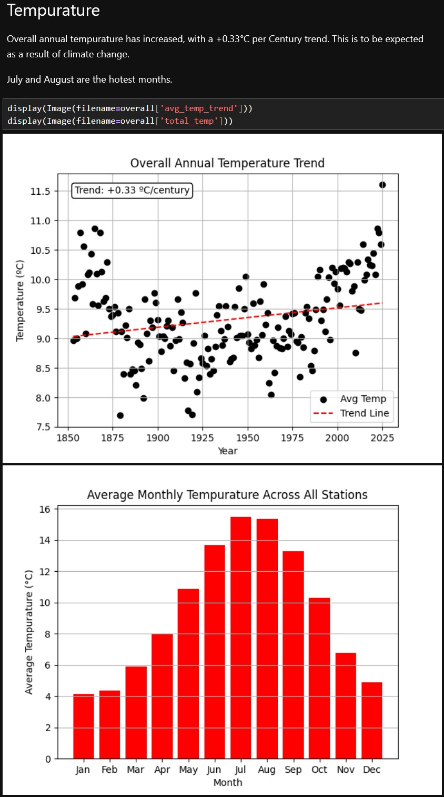
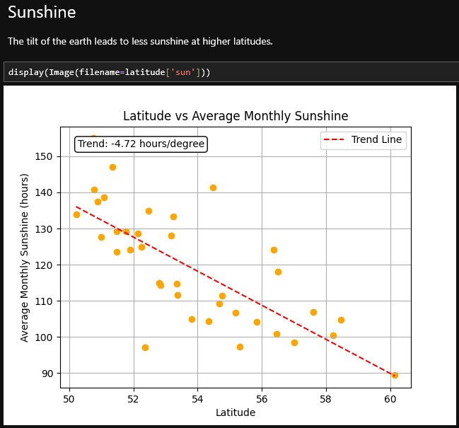
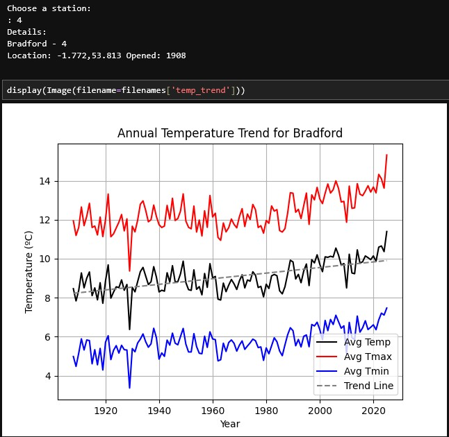

# UK Weather Analysis
Python Data Analysis Project for UK weather.

Uses SQLite database, BeautifulSoup4 for web scraping and Jupyter Lab for the Notebook.

Gets data from:
https://www.metoffice.gov.uk/research/climate/maps-and-data/historic-station-data

## Installation
> pip install -r requirements.txt
## Usage
To scrape data and store in database:
> python -m src.scraper

To run API locally:
> uvicorn src.api:app

Then go to the [Notebook](Notebook.ipynb) to view the summary.

Or go to [localhost:8000/docs](http://localhost:8000/docs) to use api yourself.

## Examples from the Notebook

---

---

---

## TODO
- Clean up Graph creation code.
- Add Air Frost analysis.
